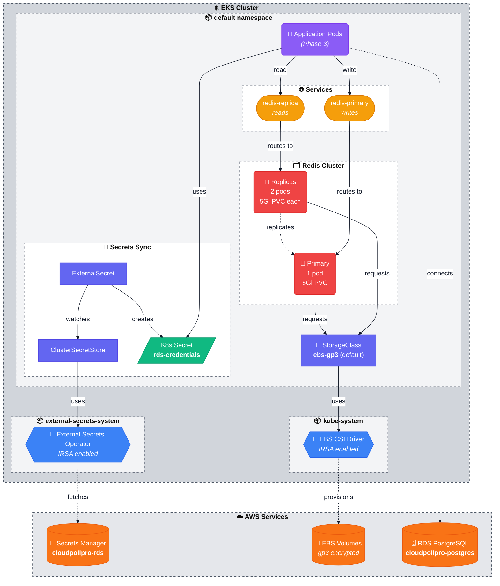

# Kubernetes Resources

This directory contains Kubernetes manifests for CloudPollPro's core services deployed on EKS.

## Architecture Overview



**Color Palette** (Material Design 3):
- 🟠 **AWS Services** (Orange-500): External managed services
- 🔵 **Operators** (Blue-500): K8s controllers and drivers
- 🔴 **Workloads** (Red-500): Running pods (Redis, apps)
- 🟡 **Services** (Amber-500): Network routing and discovery
- 🟢 **Secrets** (Green-500): Sensitive credentials
- 🟣 **Config Resources** (Indigo-500): CRDs and configuration
- 🟪 **Application** (Purple-500): Future application pods

**Shape Legend:**
- 🛢️ **Cylinders** (AWS managed services): Secrets Manager, EBS, RDS
- ⬡ **Hexagons** (K8s operators/controllers): CSI Driver, External Secrets Operator
- ⬭ **Rounded rectangles** (Pods/workloads): Redis Primary, Redis Replicas, Applications
- 🏟️ **Stadium shapes** (Services): redis-primary, redis-replica
- 📄 **Parallelogram** (Kubernetes Secrets): rds-credentials
- 📦 **Rectangles** (Resources/config): StorageClass, ClusterSecretStore, ExternalSecret

## Components

### 1. Storage (`storage/`)

**EBS CSI Driver Integration**
- **StorageClass**: `ebs-gp3` (default)
  - Provisioner: `ebs.csi.aws.com`
  - Volume type: gp3 (encrypted)
  - Binding mode: WaitForFirstConsumer (topology-aware)
  - Allows volume expansion

**Why**: Dynamic provisioning of persistent EBS volumes for stateful workloads.

### 2. Redis (`redis/`)

**Primary-Replica Architecture**
- **Primary StatefulSet**: 1 replica
  - Handles all write operations
  - AOF (Append-Only File) + RDB snapshots for persistence
  - 5Gi persistent volume per pod
  - Service: `redis-primary.default.svc.cluster.local:6379`

- **Replica StatefulSet**: 2 replicas
  - Handles read operations (load balancing)
  - Replicates from primary via stable DNS
  - 5Gi persistent volume per pod
  - Service: `redis-replica.default.svc.cluster.local:6379`

- **Headless Service**: `redis-headless`
  - Provides stable DNS for StatefulSet pods
  - Example: `redis-primary-0.redis-headless.default.svc.cluster.local`

**Configuration** (`configmap.yaml`):
- Persistence: AOF enabled + RDB snapshots (900s/1 key, 300s/10 keys, 60s/10000 keys)
- No authentication (dev environment)
- Max memory policy: noeviction

**Why**: Session storage, caching, real-time features for CloudPollPro application.

### 3. Secrets Management (`secrets/`)

**External Secrets Operator Integration**
- **ClusterSecretStore**: `aws-secrets-manager`
  - Provider: AWS Secrets Manager (eu-west-3)
  - Authentication: IRSA (IAM Roles for Service Accounts)
  - Scope: Cluster-wide, usable from any namespace

- **ExternalSecret**: `rds-credentials`
  - Source: `cloudpollpro-rds-*` in AWS Secrets Manager
  - Target: Kubernetes Secret `rds-credentials`
  - Refresh interval: 1 hour
  - Synced fields: username, password, host, port, dbname

**Why**: Secure credential management without storing secrets in git. Automatic sync from AWS Secrets Manager to Kubernetes.

## Resource Dependencies

```
1. EBS CSI Driver (Terraform-managed EKS addon)
   └─> StorageClass created

2. StorageClass ready
   └─> Redis StatefulSets deployed
       └─> PVCs provisioned
           └─> EBS volumes attached

3. External Secrets Operator (Helm-installed)
   └─> IAM role created (Terraform)
       └─> ClusterSecretStore configured
           └─> ExternalSecret syncs
               └─> Kubernetes Secret created
```

## Deployed Services

| Service | Type | Endpoint | Purpose |
|---------|------|----------|---------|
| `redis-primary` | ClusterIP | `redis-primary.default.svc.cluster.local:6379` | Write operations |
| `redis-replica` | ClusterIP | `redis-replica.default.svc.cluster.local:6379` | Read operations |
| `redis-headless` | Headless | `redis-primary-0.redis-headless.default.svc.cluster.local:6379` | StatefulSet stable DNS |

## Secrets Available

| Secret | Namespace | Fields | Source |
|--------|-----------|--------|--------|
| `rds-credentials` | default | username, password, host, port, dbname | AWS Secrets Manager |

## Verification Commands

```bash
# Check storage
kubectl get storageclass
kubectl get pvc

# Check Redis
kubectl get pods -l app=redis
kubectl get svc -l app=redis
kubectl exec -it redis-primary-0 -- redis-cli ping
kubectl exec -it redis-primary-0 -- redis-cli INFO replication

# Check secrets
kubectl get clustersecretstore
kubectl get externalsecret
kubectl get secret rds-credentials
kubectl get secret rds-credentials -o jsonpath='{.data.host}' | base64 -d

# Check External Secrets Operator
kubectl get pods -n external-secrets-system
kubectl get sa external-secrets -n external-secrets-system -o yaml | grep role-arn
```

## Future Additions

This directory will expand to include:
- **Phase 3**: Application deployments (poll-service, vote-service, results-service)
- **Phase 4**: Ingress resources (ALB configuration)
- **Phase 5**: Monitoring stack (Prometheus, Grafana)

## Usage in Application Code

### Connecting to Redis (Primary for writes)
```yaml
env:
  - name: REDIS_HOST
    value: "redis-primary.default.svc.cluster.local"
  - name: REDIS_PORT
    value: "6379"
```

### Connecting to Redis (Replica for reads)
```yaml
env:
  - name: REDIS_REPLICA_HOST
    value: "redis-replica.default.svc.cluster.local"
  - name: REDIS_REPLICA_PORT
    value: "6379"
```

### Connecting to RDS PostgreSQL
```yaml
env:
  - name: DB_HOST
    valueFrom:
      secretKeyRef:
        name: rds-credentials
        key: host
  - name: DB_PORT
    valueFrom:
      secretKeyRef:
        name: rds-credentials
        key: port
  - name: DB_NAME
    valueFrom:
      secretKeyRef:
        name: rds-credentials
        key: dbname
  - name: DB_USER
    valueFrom:
      secretKeyRef:
        name: rds-credentials
        key: username
  - name: DB_PASSWORD
    valueFrom:
      secretKeyRef:
        name: rds-credentials
        key: password
```

## Notes

- All persistent data survives pod restarts/deletions
- Redis replicas are read-only; writes must go to primary
- EBS volumes are encrypted at rest (AWS-managed keys)
- Secrets are automatically refreshed every hour from AWS Secrets Manager
- StatefulSets provide stable network identities and ordered deployment/scaling
